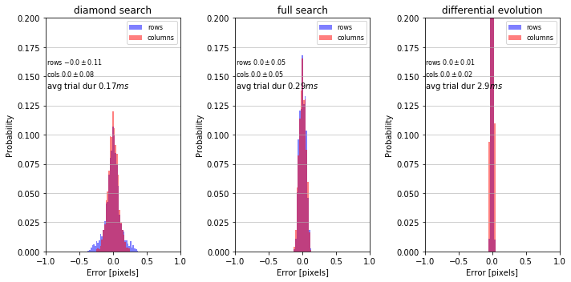
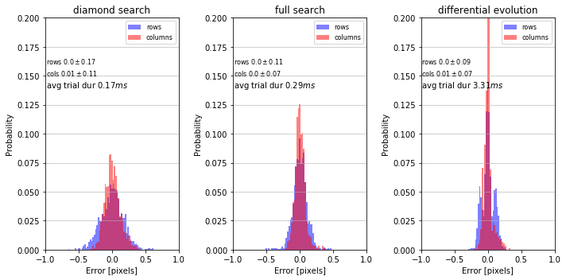
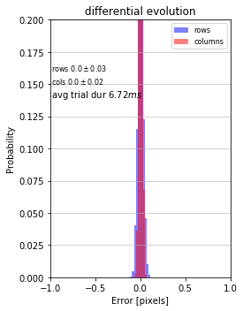
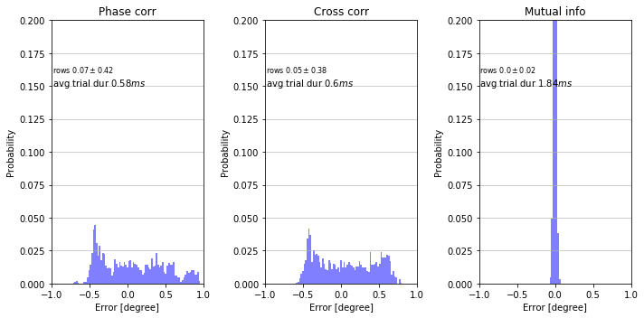
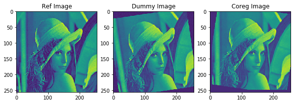

# Image-coregistration-translation-rotation 
Python implementation of Fourier-Mellin transform to coregister (translation with sub-pixel and rotation with sub-degree accuracy) two 2D (single channel) images 

### monte_carlo_translation_coreg.py 
The script performs Monte Carlo simulations (Ntrials = 2000, -10 pixels <= shift <= 10 pixels) comparing sub-pixel corregistration (translation) accuracy of seven methods:
    
(1) Phase correlation (pixel level) with diamond search (sub-pixel level), image comparison metric = mean squared error 
(2) Phase correlation (pixel level) with full search (sub-pixel level), image comparison metric = mean squared error 
(3) Phase correlation (pixel level) with differential evolution (sub-pixel level), image comparison metric = mean squared error 
    

  

    
(4) Cross correlation (pixel level) with diamond search (sub-pixel level), image comparison metric = mean squared error 
(5) Cross correlation (pixel level) with full search (sub-pixel level), image comparison metric = mean squared error 
(6) Cross correlation (pixel level) with differential evolution (sub-pixel level), image comparison metric = mean squared error 

  

(7) Mutual information with differential evolution (sub-pixel level), image comparison metric = mutual information

  

### monte_carlo_rotation_coreg.py 
The script performs Monte Carlo simulations (Ntrials = 2000, -10 pixels <= shift <= 10 degrees) comparing sub-degree coregistration (rotation) accuracy of 3 methods:
    
(1) Phase correlation (degree level) in Polar coordinate system with differential evolution (sub-degree level), 
image comparison metric = mean squared error 
(2) Cross correlation (degree level) in Polar coordinate system with differential evolution (sub-degree level), 
image comparison metric = mean squared error 
(3) Mutual information in Cartesian coordinate system with differential evolution (sub-degree level), 
image comparison metric = mutual information 
    

  

    
### demo_image_coregestration.py 
Demo showing how to coregister two 2D images

  

    
Expected rotation angle: 7.96 
Determined rotation angle: 7.9863800832673615 
Expected translation Row: -0.42 Col: -9.64 
Determined translation Row: -0.4357482894087572 Col: -9.65762680684138 
